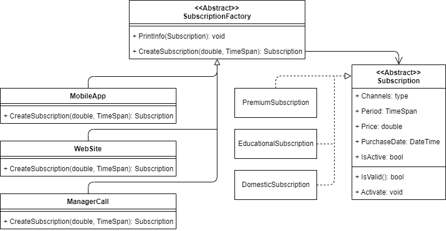
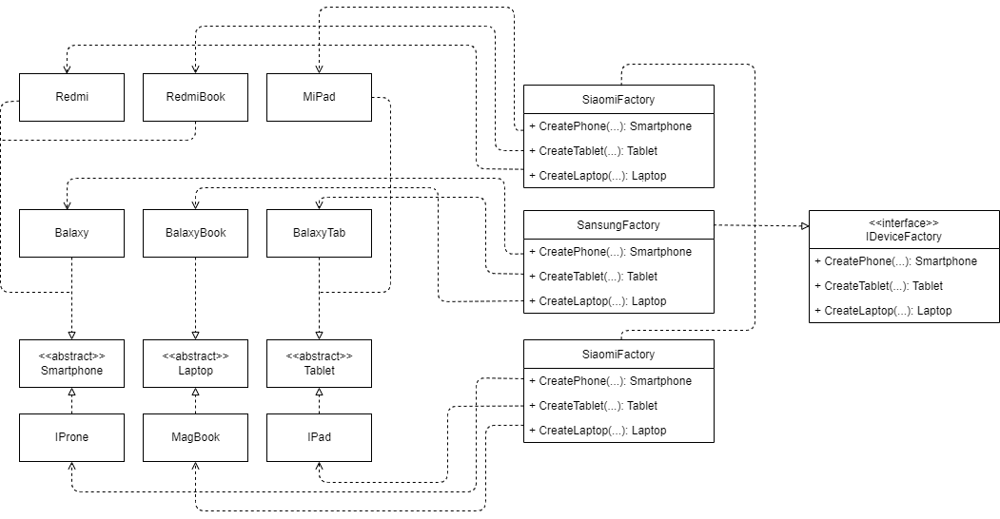
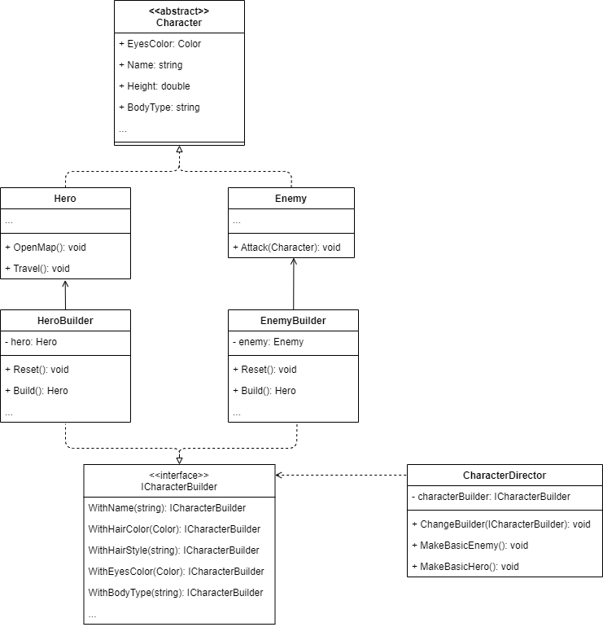

# Creational Patterns

## Content

- Factory Method
  - [Realization](./VideoProvider/)
  - [Demo app](./FactoryMethodDemo/Program.cs)
- Abstract Factory
  - [Realization](./DeviceProduction/)
  - [Demo app](./AbstractFactoryDemo/Program.cs)
- Singleton
  - [Realization](./Authenticator/Authenticator.cs)
  - [Demo app](./SingletonDemo/Program.cs)
- Prototype
  - [Realization](./VirusFamily/Virus.cs)
  - [Demo app](./PrototypeDemo/Program.cs)
- Builder
  - [Realization](./GameRPG/)
  - [Demo app](./BuilderDemo/Program.cs)

## Diagrams

### Factory method

### Abstract Factory

### Builder

